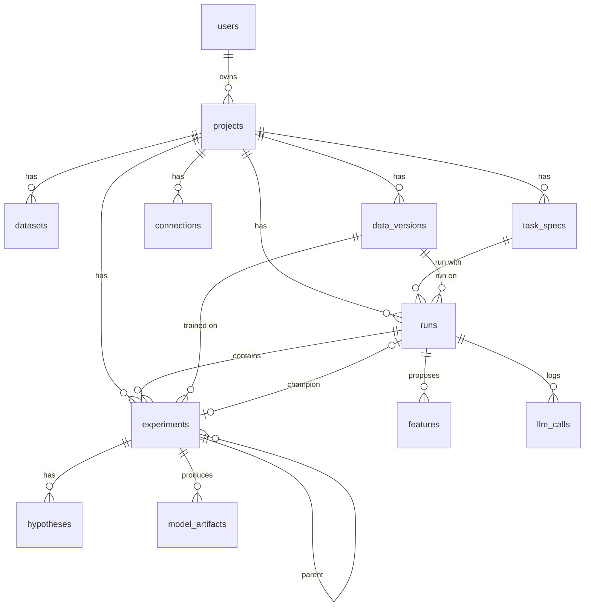

# MLPilot Architecture

## Overview

MLPilot is structured as a layered, provider-interface-based system:

```
┌─────────────────────────────────────────────────────────┐
│                     Frontend (React)                      │
│         Vite + React 18 + TypeScript + Tailwind           │
└─────────────────────────┬───────────────────────────────┘
                          │  HTTP/REST
┌─────────────────────────▼───────────────────────────────┐
│                  FastAPI Backend                          │
│         /api/v1/{projects,datasets,experiments,...}       │
│         Pydantic v2  │  SQLAlchemy 2.x async             │
└──────┬───────────────┼──────────────────────────────────┘
       │               │
┌──────▼──────┐  ┌─────▼─────────────────────────────────┐
│  AI Gateway │  │           ML Engine                     │
│             │  │  DatasetProvider  DataPreparationProvider│
│  Providers: │  │  ValidationStrategy  MetricProvider     │
│  - Groq     │  │  ModelProvider  ExperimentRunner        │
│  - Gemini   │  │  ReportProvider  DeploymentProvider     │
│  - NVIDIA   │  └────────────────────────────────────────┘
│  - OpenRtr  │
│  - Cerebras │
│  - Mistral  │
│  - Stub ✓   │
└─────────────┘
```

## Key Design Principles

1. **Provider Interface Pattern** — All capabilities are behind ABCs. Swap implementations without changing callers.
2. **LLM ≠ Determinism** — LLMs interpret evidence and propose hypotheses. Deterministic Python owns training, metrics, and artifacts.
3. **Fallback Chain** — AI Gateway tries providers in priority order. StubProvider is always the last resort (no API key needed).
4. **OpenAI-Compatible First** — All providers that support the OpenAI API shape (Groq, NVIDIA NIM, OpenRouter, Cerebras, Mistral) use the same `openai` SDK with a different `base_url`.
5. **Cost Awareness** — Every AI call is tracked (provider, model, tokens, cost_usd) via CostTracker.

## Layers

### Frontend
- React 18 + TypeScript + Tailwind CSS
- React Router for navigation
- Axios for API calls

### Backend (FastAPI)
- `app/api/v1/` — REST endpoints
- `app/services/` — Business logic
- `app/db/models/` — SQLAlchemy ORM models
- `app/schemas/` — Pydantic v2 schemas

### ML Engine (`ml/`)
- `ml/core/interfaces.py` — All 9 ABCs
- `ml/data/` — Ingestion, profiling, preparation
- `ml/validation/` — Validation strategies + leakage detection
- `ml/experiments/` — Experiment schema + runner
- `ml/metrics/` — Classification + regression metrics
- `ml/baselines/` — Baseline model runners

### AI Gateway (`ai/`)
- `ai/gateway.py` — Central dispatcher with fallback
- `ai/router.py` — Task-type → provider routing
- `ai/cost_tracker.py` — Usage logging
- `ai/providers/` — 10 provider implementations

## Database Schema

The metadata DB (SQLite by default, Postgres via `DATABASE_URL`) is owned by Alembic
(`backend/migrations/`). The app runs `alembic upgrade head` on start-up
(`app/db/migrations.py`); a database made before migrations existed is stamped at
`0001` first so its rows are kept. See `docs/experiment_schema.md` for the experiment JSON.

| Table | What it holds |
|---|---|
| `users`, `projects` | Accounts and projects; `projects.settings` holds privacy level and budgets |
| `datasets` | Uploaded files with their profile (pre-relational) |
| `data_versions` | Immutable snapshots of a file or database, keyed by content hash |
| `connections` | Saved read-only DB connections; only a `secret_ref`, never the password |
| `task_specs` | Versioned prediction task specs (YAML), draft or confirmed |
| `runs` | One run of a task spec on a data version: split plan, engine, seed, budget, status |
| `experiments` | One trained candidate; linked to its run and data version, with val/test metrics and `decision_mode` |
| `features` | Proposed features (SQL, formula or IR), guard results, validated gain and status |
| `llm_calls` | Every LLM call: provider, model, tokens, cost, `decision_mode`, prompt hash |
| `hypotheses`, `model_artifacts` | Agent hypotheses and trained model files |


