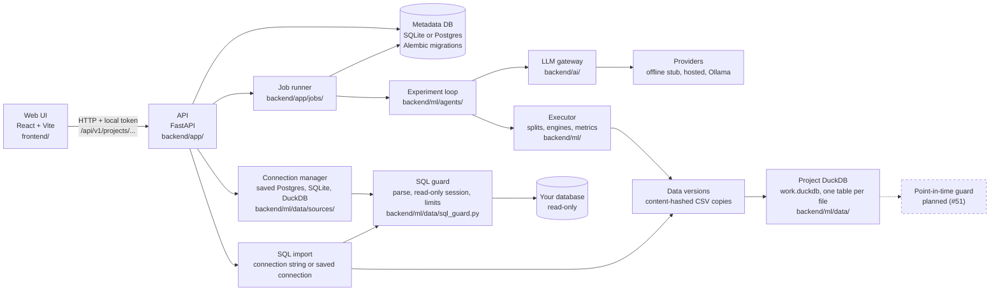
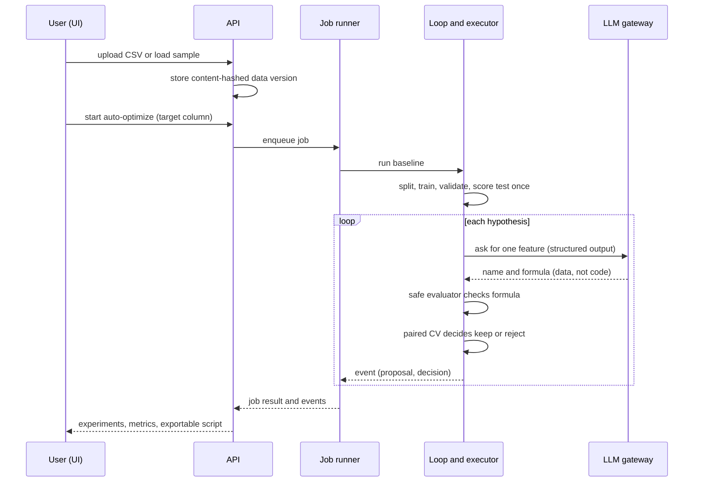
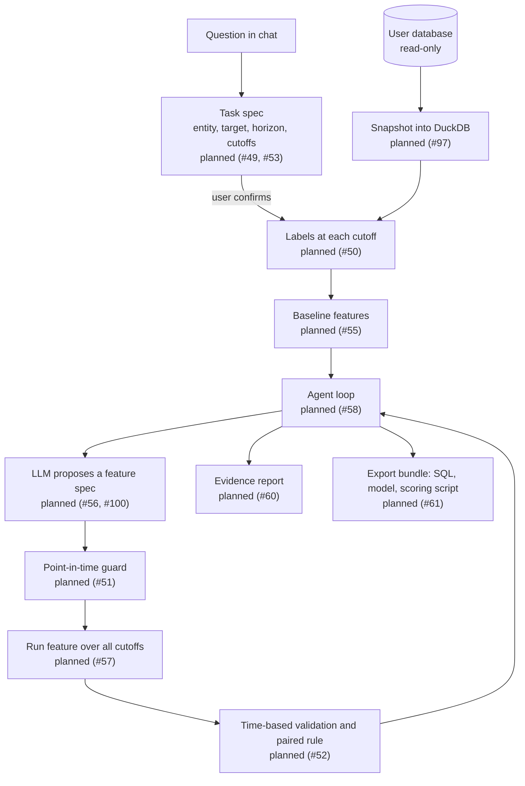
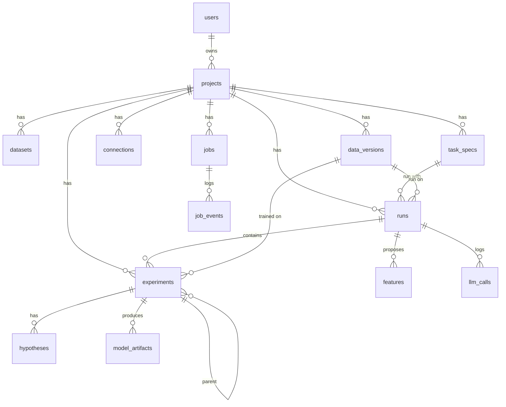

# MLPilot architecture

This describes what is built and what is planned. Anything not covered by a test is marked `planned (#N)`, where N is the GitHub issue. The reasons behind the main choices are in [`docs/adr/`](adr/README.md); the product direction is in [`ROADMAP.md`](ROADMAP.md).

## Components

Solid boxes are built and covered by tests in CI. Dashed boxes are planned.

| Component | Where | What it does today |
|---|---|---|
| Web UI | `frontend/` | Loads a sample or a CSV, shows experiments and metrics, runs the agent loop. All API calls go through `frontend/src/api/`, typed from the generated `schema.d.ts`. |
| API | `backend/app/api/v1/` | Resource routes under `/api/v1/projects/{id}/...` (datasets, experiments, agent, jobs, chat). Every route needs the local token ([ADR 0008](adr/0008-self-hosted-single-user-security.md)). |
| Data engine | `backend/ml/data/engine.py`, `workspace.py` | Every file becomes a table in the project's `work.duckdb`; profiling, the leakage scan and training read it through one `DataSource` interface ([ADR 0002](adr/0002-duckdb-internal-engine.md)). |
| Job runner | `backend/app/jobs/` | Training and the agent loop run as durable jobs: they survive restarts, report an ordered event log and can be cancelled. |
| Metadata DB | `backend/app/db/`, `backend/migrations/` | Projects, data versions, experiments, jobs and events. Alembic owns the schema ([ADR 0010](adr/0010-metadata-db-alembic-sqlite.md)). |
| LLM gateway | `backend/ai/` | One entry point for every model call, routing, cost tracking, fallback to an offline stub that is marked as a fallback. |
| Experiment loop | `backend/ml/agents/decision_agent.py` | Baseline, then one LLM-proposed formula feature at a time; each is kept or rejected by code ([ADR 0001](adr/0001-llm-proposes-code-decides.md), [0006](adr/0006-temporal-validation-and-paired-acceptance.md)). |
| Executor | `backend/ml/experiments/` | Split, train, tune on validation, score test once, compute metrics, store a run manifest. |
| Safe evaluator | `backend/ml/features/safe_eval.py` | Parses and evaluates feature formulas against a whitelist. |
| Leakage scanner | `backend/ml/validation/leakage.py` | Flags columns that look like leaks (single-table). |
| Connection manager | `backend/ml/data/sources/`, `backend/app/services/connection_service.py` | Named connections to Postgres, SQLite and DuckDB. Passwords are an environment reference or Fernet-encrypted, never returned or logged; every query goes through the SQL guard; a test endpoint reports the server version and whether the role could write ([ADR 0011](adr/0011-connection-secrets-and-drivers.md)). |
| Schema graph | `backend/ml/data/schema_graph.py` | Reads tables, keys, row counts and time columns of a connected database through the SQL guard, infers missing foreign keys (names, types, value overlap of at least 95%), flags a table whose only time column is a last-modified time, and applies the user's overrides stored on the connection. Served by `GET` and `PATCH /connections/{id}/schema`. |
| Column statistics | `backend/ml/data/profiling/db_stats.py` | Aggregate SQL per table through the SQL guard (one row per query, top values at most `top_k` rows), sampled above a million rows (`TABLESAMPLE SYSTEM` on Postgres, `USING SAMPLE` on DuckDB, `rowid % k` on SQLite), cached per connection in `table_stats`. Served by `GET /connections/{id}/tables/{table}/stats`. |
| SQL guard | `backend/ml/data/sql_guard.py` | The only code that executes SQL on a user database: parses and checks the query, runs it in a read-only session with row, size and time limits, and logs a hash of it ([ADR 0003](adr/0003-read-only-in-three-layers.md)). |
| SQL import | `backend/ml/data/ingestion/sql_loader.py` | Takes one read-only `SELECT` from a user database (saved connection or connection string) into a CSV data version, through the SQL guard. |

## Data flow today (single CSV)

## Data flow planned (relational database)

## Guard layers

| Layer | Protects against | Status |
|---|---|---|
| Local token, CORS allowlist, localhost bind | Other sites or machines using the API | Implemented (#92) |
| SQL guard, layer 1: parser allowlist | Writes, DDL, side-effect functions, secret system tables, tables outside the schema | Implemented (#44): `ml/data/sql_guard.py`, hostile-query matrix in `tests/fixtures/hostile_sql.yaml` |
| SQL guard, layer 2: read-only session, row/size limit, timeout | A query that changes data or runs away, even if layer 1 missed it | Implemented for Postgres, SQLite and DuckDB (#44) |
| SQL guard, layer 3: database role check | A role that could write | Reported as `can_write` by the connection test (#43, #44); the UI warning is `planned (#46, #103)` |
| Project DuckDB without external file access, `SELECT`-only `DataSource.query` | A query reading or writing files outside the project's own tables | Implemented (#42) |
| Safe formula evaluator | Executing model output | Implemented (#37) |
| Acceptance rule in code | Keeping noise, or the LLM judging itself | Implemented (#35) |
| One split contract, test scored once | Tuning on the data we report | Implemented (#34) |
| Leakage scanner | Columns that leak the target | Implemented, single-table (#38) |
| Point-in-time guard | Features that use data after the cutoff | `planned (#51, #54)` |
| Prompt context builder and log | Raw values leaving the machine | `planned (#48)` |

## Domain model

The metadata database holds the tables below. `docs/experiment_schema.md` describes the experiment JSON and the run manifest, and the migrations are in `backend/migrations/`.

| Table | What it holds |
|---|---|
| `users`, `projects` | The local user and projects; `projects.settings` holds privacy level and budgets |
| `datasets` | Uploaded files with their profile (before the relational work) |
| `data_versions` | Immutable snapshots keyed by content hash |
| `connections` | Saved read-only connections; only a `secret_ref`, never a password, and the `can_write` result of the last test |
| `task_specs` | Versioned prediction task specs. The table exists; the feature is `planned (#49)` |
| `runs` | One run of a task spec on a data version. The table exists; relational runs are `planned (#58)` |
| `experiments` | One trained candidate with its metrics, decision and run manifest |
| `features` | Proposed features and their validated gain. The table exists; `planned (#56)` |
| `llm_calls` | Every LLM call (provider, model, tokens, cost, decision mode, prompt hash). The table exists; logging all calls to it is `planned (#48)` |
| `jobs`, `job_events` | Background jobs and their ordered event log |
| `hypotheses`, `model_artifacts` | Agent hypotheses and trained model files |

## Where things live

| Path | What it is |
|---|---|
| `backend/app/` | FastAPI app, services, ORM models, schemas |
| `backend/ai/` | LLM gateway: providers, routing, cost tracking |
| `backend/ml/data/` | The DuckDB engine, live sources, the SQL guard, ingestion, profiling, preparation |
| `backend/ml/validation/` | Splits and the leakage scanner |
| `backend/ml/experiments/` | Executor, acceptance rule, run manifest |
| `backend/ml/models/engines/` | Model engines behind one interface |
| `backend/ml/metrics/` | Classification, ranking and calibration metrics |
| `backend/ml/features/` | Safe formula evaluator |
| `backend/ml/agents/` | The experiment loop and the cleaning agent |
| `frontend/` | The web UI |
| `docker/demo-db/` | Synthetic e-commerce demo database: seeded generator, schema, read-only and write roles, SQLite and DuckDB export |
| `docs/adr/` | Decision records |

Planned modules (created where the issues say): `ml/data/schema_graph.py`, `ml/tasks/`, `ml/reports/`, `ml/export/`, `benchmarks/`.
